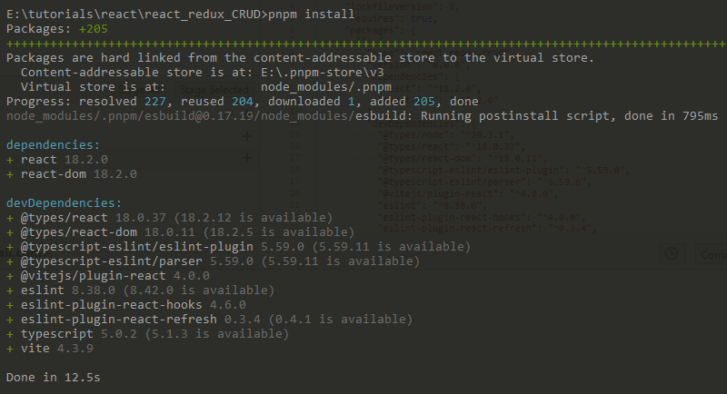
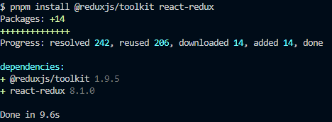

# react redux CRUD
## _Course based on Youtube video with Fazt Code_
[React y Redux Toolkit CRUD (con TailwindCSS)](https://www.youtube.com/watch?v=w2rAP7d6ndg)

## 0a. Preconditions
1. Install the NPM and NODEJS in your system [Nodejs Download](https://nodejs.org/en/download/current/)
2. Check in $path or %path% the nodeJS and npm are on it
  ```Mathematica
  C:/Program Files/nodejs
  ```
3. Install also `pnpm` [pnpm installation](https://pnpm.io/installation), it is more fast than `npm`
4. Install Postman
  [Postman Download](https://www.postman.com/downloads/)
5. Install MySQL 5.6.x
  [MySQL Download 5.6.26](https://downloads.mysql.com/archives/community/)
6. Install Visual Studio Code
  [Visual Studio Download](https://code.visualstudio.com/insiders/)

## 0b. Starting the proyect
1. I used [Vite](https://vitejs.dev/guide/), the best way to start any front-end project, with Typescrypt and a lot of templates:
```Mathematica
npm init vite@latest react_redux_CRUD --template react-ts
```
2. Following the instruccions, install the applications based on the `package.json` file.
```Mathematica
pnpm install
```
This is an example running with `pnpm`

3. And run the application.
```Mathematica
pnpm dev
```
4. Some changes in the "vite.config.ts" file, based on [Create react app vs Vite](https://dev.to/keefdrive/create-react-app-vs-vite-2amn):
```javascript
import { defineConfig } from 'vite'
import react from '@vitejs/plugin-react'
import path from 'path' // pnpm install -D @types/node

// https://vitejs.dev/config/
export default defineConfig({
  plugins: [react()],
  resolve: {
    alias: [{ find: '@', replacement: path.resolve(__dirname, 'src') }],
  },
})
```
5. Install the pending elements showing as error in `path`
```Mathematica
pnpm install -D @types/node
```

## 1a. Redux to store main data 
1. [Install Redux Toolkik an React-Redux](https://redux-toolkit.js.org/tutorials/quick-start)
```Mathematica 
pnpm install @reduxjs/toolkit react-redux
```

2. Create a "redux" directory, and put there the "store.ts" file.
3. Write in this file this first line:
```javascript
import { configureStore } from "@reduxjs/toolkit";
```
4. the next lines could be:
```javascript
const store = configureStore({});
export default store;
```
or
```javascript
export default configureStore({});
```
I used the second one.

5. In the main file "App.tsx" add a `Provider` to include all the others
```javascript
import { Provider } from "react-redux";
```
6. Call the `store` from ""store.ts".
```javascript
import store from "./redux/store";
```
7. Finally I change the return by this:
```javascript
    <>
      <Provider store={store}>
        <div className="App">
          <h1>Hola Mundo</h1>
        </div>
      </Provider>
    </>
```
8. Create a directory called "states" into redux, and create a file called "tasksSlides.ts".
9. Create a basic `Slice` to store the values and process to do:
```javascript
import { createSlice } from '@reduxjs/toolkit'
export const tasksSlice = createSlice({
  name: 'taskSlice',
  initialState: [], 
  reducers:{
  }
});
export default tasksSlice.reducer;
```
10. This is the "index.ts" file for this "states" directory:
```javascript
export * from './tasksSlices';
```
11. This is how I use this `slice` into the "store.ts" file:
```javascript
export default configureStore({
  reducer: {
    task: tasksSlice.reducer,
  }
});
```
12. I create a "pages" directory and add a Component called "Home.tsx"
13. The "App.tsx" file to change and show the new page called "Home".
```javascript
    <>
      <Provider store={store}>
        <div className="App">
          <Home/>
        </div>
      </Provider>
    </>
```

## 1b. To use the values and call the task
1. In the "Home.tsx" file import the `useSelector` from `'react-redux'`
2. Add a "models" directory with a "task.model.ts" file.
```javascript
export interface TaskInterface{
  id: string;
  name: string;
}
```
3. Assigned this to "tasksSlices.ts", to use in the InitalState, with an empty array of ths data from `TaskInterface`.
4. Very important to assign types or Interface in the "store.ts" file.
```javascript
export interface AppStore{
  tasks : TaskInterface[];
}
export default configureStore<AppStore>({
  reducer: {
    tasks: tasksSlice.reducer,
  }
});
```
5. Into "Home.tsk" file call the `useSelector`, using this format:
```javascript
const tasksState = useSelector<AppStore>(state => state.tasks);
```
To show in a `console.log`.

6. Added two new basic Components, called: TaskForm, and TaskList.
7. The new components are added to "Home.tsx" file.

## 2a. Basic elements in TaskList and TaskForm 
1. Complete the `initialState` in "tasksSlices.ts" file.
```javascript
const initialState: TaskInterface[] = [
  { id: "1", title: "Task1", description: "Task1 description", completed:false,},
  { id: "2", title: "Task2", description: "Task2 description", completed:false,}];
```
2. Then I have to chenge the `TaskInterface` in "task.model.ts" file:
```javascript
export interface TaskInterface{
  id: string;
  title: string;
  description: string;
  completed: boolean;
}
```
3. Remove or become to Comment the `useSelector` in "Home.tsx" file.
4. Put the `useSelector` in the "TaskList.tsx" file:
```javascript
const tasksState = useSelector((state:AppStore) => state.tasks );
```
5. Use to show the list of elements
```javascript
      {tasksState.map(task =>(
        <div key={task.id}>
          <h3>{task.title}</h3>
          <p>{task.description}</p>
        </div>
      ))} 
```
6. to "taskForm.tsk" component, add an `<input>`, `<textarea>`, and a `<button>`.
7. Add an `useState` just with an empty title, and description:
```javascript
  const [task, setTask] = useState({ title:'', description: '' });
```
8. put an Event manager when Change, and assign to the `<input>`, and `<textarea>`
```javascript
  const handleChange = (e:any) => {
    console.log('event:', e.target.value, e.target.name);
  };
```
9. The `handleChange` method change to store 
10. For the `<button>` I associate and event called `handleSubmit`
```javascript
  const handleSubmit =  (e:any) => {
    e.preventDefault(); // Avoid to Page refresing
    console.log(task);
  }
```

## 2b. List and Create (react RTK)
1. In the "tasksSlices.ts" file add finale a first function, into `reducers:{`.
```javascript
  reducers: {
    addTask: (state, action) =>{
      console.log(state, action);
    }
```
2. Add to "TaskForm.tsx" and `useDispatch()`
```javascript
const dispatch=useDispatch();
```
3. The `handleSubmit` to add this `dispatch`.
```javascript
    dispatch(addTask(task));
```
4. Correction to `addTask` of the "taslSlice.ts" file, to really add an object.
```javascript
    addTask: (state, action) =>{
      state.push(action.payload);
    }
```
5. There are and error, because the "id" is empty when it shows in "TaskList", then install a Generator of ID:
```Mathematica
pnpm i uuid
```
6. As well install the types for this `uuid`:
```Mathematica
npm i --save-dev @types/uuid
```
7. Add the new generator of `uuid` in the "TaskForm.tsx" file.
```javascript
import { v4 as uuid } from 'uuid';
```
8. Use this uuid when you are going to use the `dispatch(addTask(`:
```javascript
    dispatch(addTask({
      ...task,
      id: uuid(),
    }));
```

## 3. Delete a task (React RTK)
1. Add a button in "TaskList.tsx" file by each Task:
```javascript
    <button onClick={()=>handleDelete(task.id)}>Delete</button>
```
2. By now the `handleDelete` method with a consol.log with the id
```javascript
  const handleDelete = (id:string) => {
    console.log('event:', id);
  };
```
3. Add a new `reducers` into "TaskSlice.ts" file:
```javascript
    deleleteTask: (state, action) =>{
      console.log(action.payload);
    }
```

### Note: I can not use `delTask` in the `reducers`

4. Add in the export list:
```javascript
export const {addTask, deleteTask} = tasksSlice.actions;
```
5. in the "TaskList.tsx" add the `useDispatch` from `'reac-redux'`.
```javascript
const dispatch=useDispatch();
```
6. Import the `delTask` from  "../redux" directory
```javascript
import { AppStore, deleteTask } from "../redux";
```
7. Call the `deleteTask` in the `handleDelete`
```javascript
  const dispatch=useDispatch();

  const handleDelete = (id: string) => {
    dispatch(deleteTask(id));
  };  
```
8. Change the `deleleteTask` with the find an element in the array:
```javascript
    const taskFound = state.find( task => task.id === action.payload);
```
9. Finally with the Task Found, lets to delete of array with `split`, into a conditional:
```javascript
      if (taskFound) {
        state.splice(state.indexOf(taskFound),1);
      }
```
## 4a. Rutas react-router-dom@6 (React RTK)
1. Install the [react-router-dom](https://reactrouter.com/en/main/start/tutorial)
```Mathematica
pnpm install react-router-dom
```
2. Also remember you are working with `TYPESCRIPT`, then you need install `@types/`:
```Mathematica
pnpm install @types/react-router-dom
``` 
3. We are working in "Home.tsx" file, first deleting the "Home" message into `<div>`.
4. Import the `BrowserRouter`, `Routes`, and `Route` from `react-router-dom`:
```javascript
import { BrowserRouter, Routes, Route } from 'react-router-dom';
```
5. Add the the `BrowserRouter`, and `Routes` components are over the `TaskList`, and `TaskForm`:
```javascript
      <BrowserRouter>
        <Routes>
          <TaskForm />
          <TaskList />
        </Routes>
      </BrowserRouter>
```
6. Starting to use the `Route`, calling the `TaskList`as a root, and `TaskForm` in site `'/create-task'`.
```javascript
        <Routes>
          <Route path='/' element={<TaskList/>} />
          <Route path='/create-task' element={<TaskForm/>} />
        </Routes>

```
